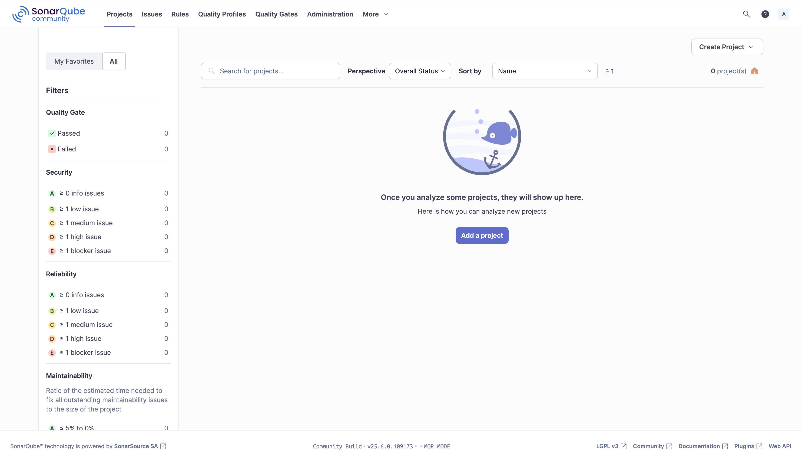
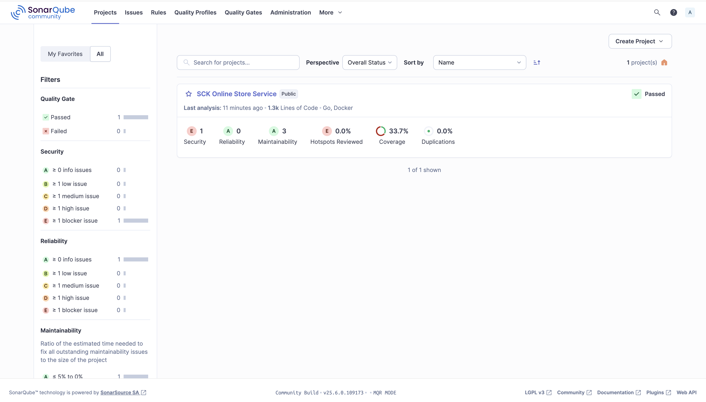
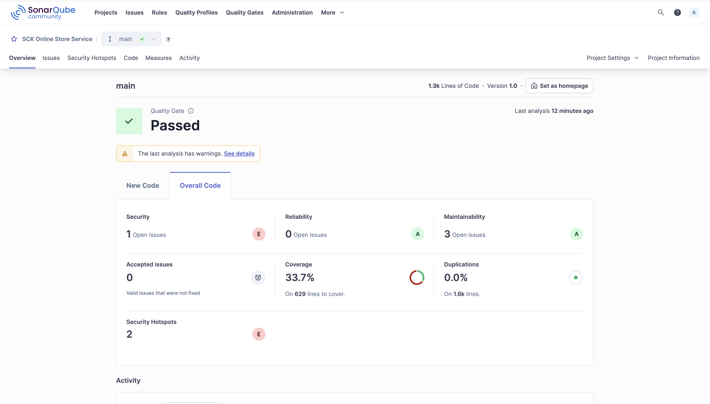
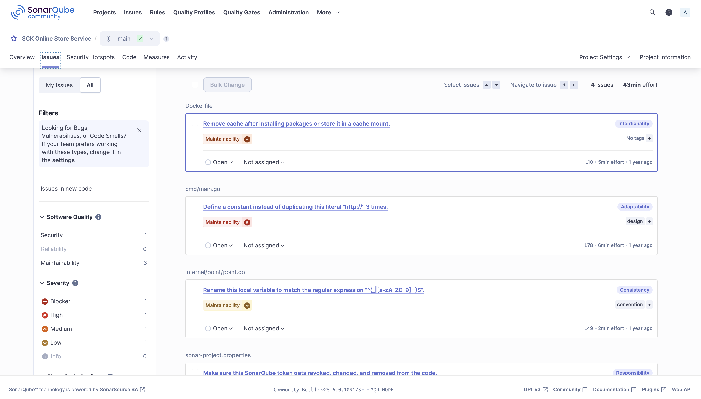
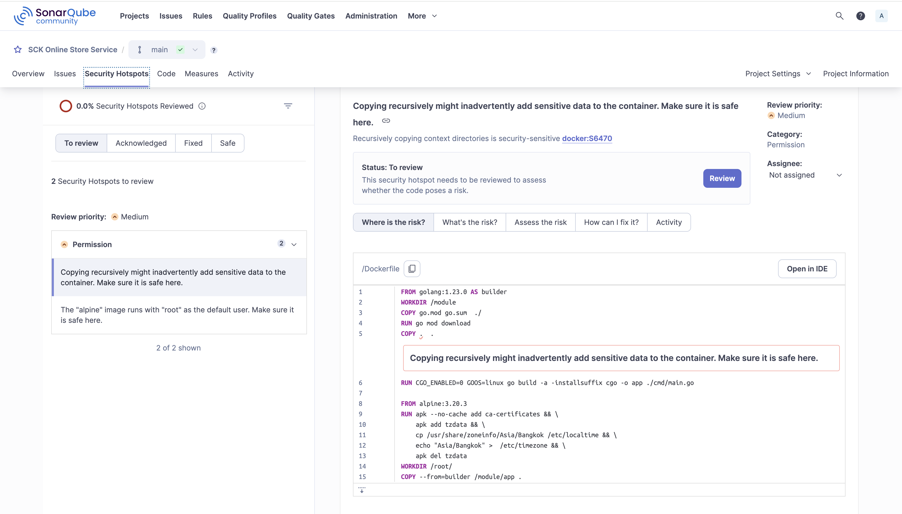
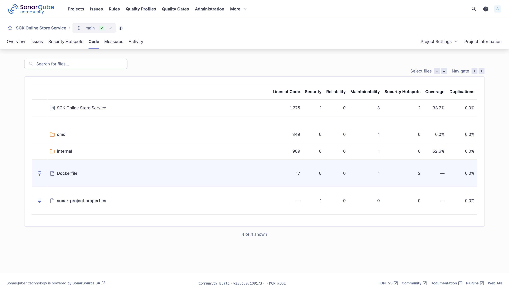
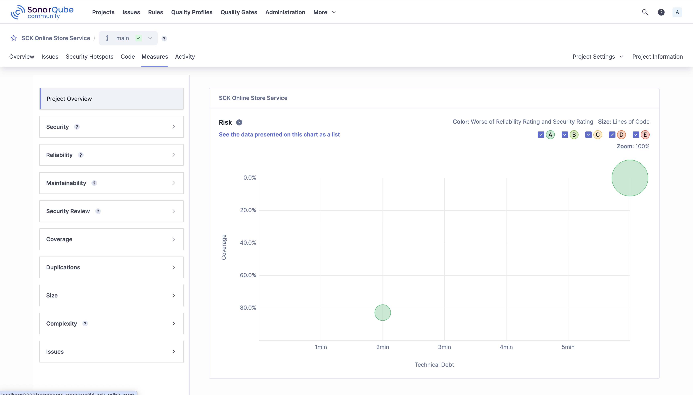

# SonarQube in Action

## 1. Install Sonarqube

- docker compose

  ```yml
  services:
    sonarQube:
      # image: sonarqube:9.9.8-community
      image: sonarqube:25.6.0.109173-community
      container_name: sonarqube
      ports:
        - '9000:9000'
      environment:
        - SONAR_JDBC_URL=jdbc:postgresql://db:5432/sonar
        - SONAR_JDBC_USERNAME=sonar
        - SONAR_JDBC_PASSWORD=sonar
      depends_on:
        - db

    db:
      image: postgres:17.5-alpine3.22
      container_name: sonar_db
      ports:
        - '5432:5432'
      environment:
        - POSTGRES_USER=sonar
        - POSTGRES_PASSWORD=sonar
        - POSTGRES_DB=sonar
  ```

- Log in to http://localhost:9000 using System Administrator credentials:
  - login: admin
  - password: admin

## 2. Install [sonar-scanner](https://docs.sonarsource.com/sonarqube-server/latest/analyzing-source-code/scanners/sonarscanner/)

- Expand the downloaded file into the directory of your choice. We'll refer to it as <INSTALL_DIRECTORY> in the next steps.
- Update the global settings to point to your instance of SonarQube Server:
  - Open the $<INSTALL_DIRECTORY>/conf/sonar-scanner.properties file.
  - Uncomment and edit the #sonar.host.url=http://localhost:9000 line to point to your SonarQube Server's URL.
- Add the <INSTALL_DIRECTORY>/bin directory to your path.
- Verify your installation by opening a new shell and executing the command sonar-scanner -h, or sonar-scanner.bat -h on Windows

## 3. Analysis parameters

- [overview](https://docs.sonarsource.com/sonarqube-server/latest/analyzing-source-code/overview/)
- sonar-project.properties

  ```properties
  # must be unique in a given SonarQube Server instance
  sonar.projectKey=my:project

  # --- optional properties ---

  # defaults to project key
  sonar.projectName=My project
  # defaults to 'not provided'
  sonar.projectVersion=1.0

  # Path is relative to the sonar-project.properties file. Defaults to .
  sonar.sources=.

  # Encoding of the source code. Default is default system encoding
  sonar.sourceEncoding=UTF-8
  ```

- run: `sonar-scanner -Dsonar.token=myAuthenticationToken -Dsonar.host.url=http://localhost:9000`
- [.Net](https://docs.sonarsource.com/sonarqube-server/latest/analyzing-source-code/scanners/dotnet/introduction/)

  - [dotnet-sonarscanner](https://www.nuget.org/packages/dotnet-sonarscanner)

    ```sh
    dotnet-sonarscanner begin /k:"project-key" /d:sonar.token="<token>" /d:sonar.host.url="http://localhost:9000"
    dotnet build <path to project file or .sln file> --no-incremental
    dotnet-sonarscanner end /d:sonar.token="<token>"
    ```

- [analysis parameters](https://docs.sonarsource.com/sonarqube-server/latest/analyzing-source-code/analysis-parameters/)
- [test coverage](https://docs.sonarsource.com/sonarqube-server/latest/analyzing-source-code/test-coverage/overview/)

## 4. Output

- Front Page

  
  

- The Dashboard

  

- Issues widget

  

- Security Hotspots

  

- Code

  

- Measures

  

## 5. Interface conventions

- 1.5.1. Hierarchy: packages and classes in a metric drilldown: Every metric on the dashboard clicks-through to a metric drilldown
- 1.5.2. File details: module/package/file
- 1.5.3. Trend arrows
